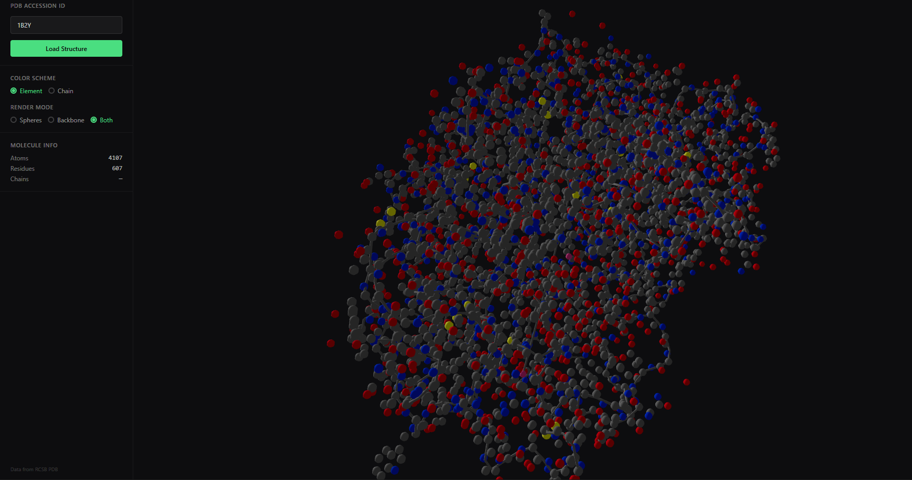

# PDB Viewer

> A lightweight, portfolio-grade 3D protein structure viewer built with raw Three.js — no NGL, Mol\*, or 3Dmol.js dependencies.




## Features

- **PDB fetch & file upload** — load by accession ID from RCSB PDB, or upload your own `.pdb` / `.ent` file
- **3D rendering** — atoms as spheres, backbone as smooth tubes, or both at once
- **Color schemes** — CPK element coloring, per-chain distinct colors, or residue-hash coloring
- **Custom colors** — pick any color per element or per chain with live color inputs
- **Theme system** — Light / Dark mode toggle with three accent presets (Green, Biology Red, Midnight Blue)
- **Export PNG** — one-click screenshot of the current viewport
- **Orbit controls** — rotate, pan, and zoom with damping; auto-rotate toggle
- **Atom tooltip** — hover any atom to see element, name, residue, and chain
- **Atom size slider** — scale all atoms and backbone from 0.3× to 2.5×
- **Quick examples** — dropdown with 6 common PDB IDs (1CRN, 4HHB, 2PTC, 1BNA, 3HHR, 1UBQ)
- **Performance LOD** — adaptive geometry resolution (>3k atoms: low-poly spheres, >8k atoms: point rendering)
- **Keyboard shortcuts** — `R` reset camera, `E` cycle color scheme, `M` cycle render mode

## Stack

| Tool | Purpose |
|---|---|
| [Vite](https://vitejs.dev) | Dev server & bundler |
| [React 18](https://reactjs.org) | UI framework |
| [Three.js](https://threejs.org) | 3D rendering engine |
| [@react-three/fiber](https://docs.pmnd.rs/react-three-fiber) | React renderer for Three.js |
| [@react-three/drei](https://github.com/pmndrs/drei) | R3F utilities (OrbitControls, Stats, Html) |
| [Tailwind CSS](https://tailwindcss.com) | Dark-themed utility-first styles |

## Getting Started

```bash
git clone <repo-url> pdb-viewer
cd pdb-viewer
npm install
npm run dev
```

Open `http://localhost:5173` in your browser. Type a valid PDB ID (try `1CRN`, `2PTC`, `3HHR`) and click **Load** or press Enter.

## Project Structure

```
src/
├── main.jsx                  # ReactDOM entry
├── index.css                 # Tailwind directives, theme CSS variables, base reset
├── App.jsx                   # Root: state management, layout, keyboard shortcuts
├── components/
│   ├── ControlPanel.jsx      # Left sidebar: search, file upload, appearance, custom colors, export
│   ├── MoleculeScene.jsx     # Three.js canvas: instanced spheres, backbone tubes, LOD, export helper
│   └── AtomTooltip.jsx       # Floating info card on atom hover
├── hooks/                    # Custom hooks (empty, ready for usePDB, etc.)
└── utils/
    ├── pdbParser.js          # fetchPDB, parsePDB (fixed-width ATOM/HETATM), centerAtoms
    └── colorSchemes.js       # CPK colors, chain palette, getAtomColor, getAtomRadius, custom overrides
```

## How It Works

PDB files use a fixed-width column format defined by the wwPDB. Each `ATOM` or `HETATM` record occupies exactly 80 characters, with fields at specific offsets: record type (1–6), serial (7–11), atom name (13–16), residue name (18–20), chain ID (22), residue sequence (23–26), and x/y/z coordinates (31–54). The parser in `pdbParser.js` reads these fields via `String.slice()` — no regex, no external libraries. Coordinates are then centered at the origin so the protein sits in the middle of the scene.

Rendering uses Three.js `InstancedMesh` grouped by element, which submits a single draw call per element type regardless of atom count. Each instance stores its position in `instanceMatrix` and its per-atom color in `instanceColor`, updated via `useLayoutEffect` when the color scheme changes. For large structures (>3000 atoms), sphere geometry segments drop from 8 to 6; above 8000 atoms the renderer switches to `Points` (gl.POINTS) to keep frame rates smooth.

The theme system uses CSS custom properties scoped to `[data-accent="..."]` for accent colors and Tailwind's `dark:` class variant for light/dark switching. Custom colors are injected into `colorSchemes.js` at runtime via a module-level `setCustomColors()` function, allowing live color pickers in the sidebar without React re-render overhead.

The Vite dev server proxies `/api/*` requests to `https://files.rcsb.org`, avoiding CORS restrictions during development. The backend URL is configurable via `VITE_PDB_BASE_URL` in `.env`. File uploads skip the network entirely, running the same `parsePDB` + `centerAtoms` pipeline on the local file contents.

## Limitations

- No hydrogen bond or secondary-structure display
- No solvent-accessible surface rendering
- Large structures (>15 000 atoms) may lag in sphere/backbone mode — the Points LOD helps but is still demanding
- Single PDB file at a time (no superposition or alignment)

## License

MIT
